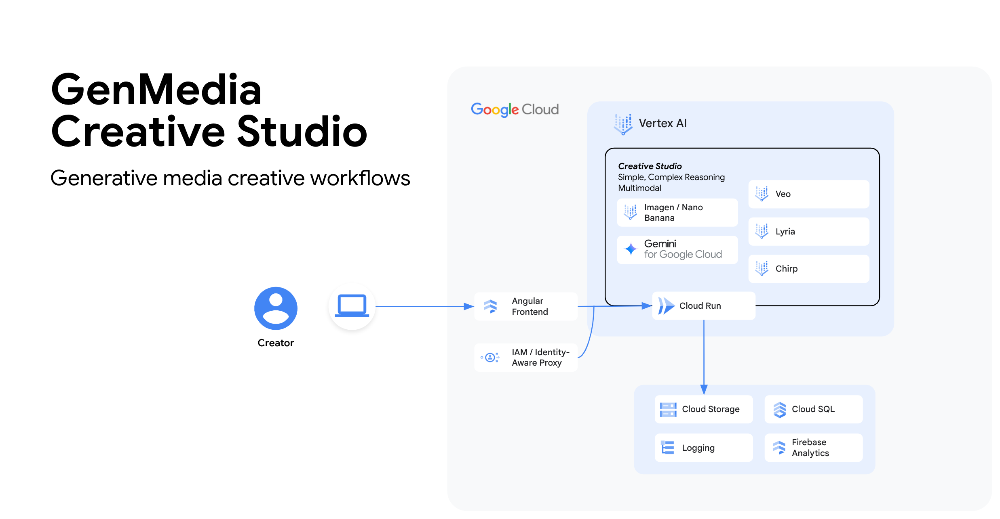

# Creative Studio Infrastructure

This repository contains the Terraform configuration for deploying the Creative Studio application platform (frontend and backend) to Google Cloud.

## 🚀 Overview

This infrastructure is managed using a modular, environment-based approach with Terraform. The key principles are:
* **Don't Repeat Yourself (DRY):** All the logic for creating a service is defined once in a reusable **module**.
* **Strong Isolation:** Each environment (`dev`, `prod`, etc.) is managed in its own directory, with its own state file, to prevent accidental changes to production.

## 📁 Directory Structure

The project is organized into `modules` and `environments`.

```
infrastructure/
│
├── modules/                # Reusable "Blueprints"
│   ├── cloud-run-service/  # Defines how to build ONE service
│   └── platform/           # Defines the ENTIRE application platform
│
└── environments/
    ├── dev/                # Configuration for the 'dev' environment
    │   ├── main.tf         # Calls the platform module with dev values
    │   ├── backend.tf      # Defines where to store the dev state file
    │   └── dev.tfvars      # Contains all variables for dev
    │
    └── prod/               # Configuration for the 'prod' environment
        └── ...
```
* **`/modules`**: Contains reusable building blocks. The `platform` module is the main entry point, which in turn uses the `cloud-run-service` module.
* **`/environments`**: Contains a directory for each distinct deployment environment. These directories call the `platform` module with the correct set of variables.

---

## Deploy in 20min!!
Just run this script which has a step by step approach for you to deploy the infrastructure and start the app, just follow the instructions
```
curl https://raw.githubusercontent.com/GoogleCloudPlatform/gcc-creative-studio/refs/heads/main/bootstrap.sh | bash
```

For better guidance, [we recorded a video](./screenshots/how_to_deploy_creative_studio.mp4) to showcase how to deploy Creative Studio in a completely new and fresh GCP Account.

<video controls autoplay loop width="100%" style="max-width: 1200px;">
  <source src="./screenshots/how_to_deploy_creative_studio.mp4" type="video/mp4">
  Your browser does not support the video tag. You can <a href="./screenshots/how_to_deploy_creative_studio.mp4">download the video here</a>.
</video>

## System Architecture


The backend follows a **Modular, Feature-Driven Architecture**, heavily inspired by the principles of Hexagonal Architecture (Ports & Adapters).

* **Structure:** Code is organized by feature domain (e.g., /images, /galleries, /users) rather than by technical layer (/controllers, /services).  
* **Rationale:**  
  * **Scalability:** This approach prevents individual directories from becoming unwieldy as the application grows.  
  * **Maintainability:** All code related to a single feature is co-located, making it easier to understand, modify, and test.  
  * **High Cohesion, Low Coupling:** Modules are self-contained and interact through well-defined interfaces (services and DTOs), making the system robust and flexible.

### Technology Stack

| Category | Technology / Service |
| :---- | :---- |
| **Frontend** | Angular, TypeScript, Angular Material, Tailwind CSS |
| **Backend** | Python, FastAPI, Pydantic |
| **Database** | Google Cloud SQL (PostgreSQL) |
| **Cloud Provider** | Google Cloud Platform (GCP) |
| **Deployment** | Cloud Run (for backend), Firebase Hosting (for frontend) |
| **AI Models** | Imagen, Veo, Gemini (via Vertex AI SDK) |


### Dependencies

Regarding the dependencies of the APIs and Services we’ll use (the Google APIs `‘xxxx.googleapis.com’` will be enabled by the script automatically):

* `Github Account` (You must have a Github Account to fork the repository)  
* `Google Cloud Account` (A GCP Project)
---
* `aiplatform.googleapis.com` (Vertex AI)  
* `artifactregistry.googleapis.com` (Artifact Registry)  
* `cloudbuild.googleapis.com` (Cloud Build)  
* `cloudfunctions.googleapis.com` (Cloud Functions)  
* `compute.googleapis.com` (Compute Engine)  
* `firebase.googleapis.com` (Firebase)  
* `sqladmin.googleapis.com` (Cloud SQL)  
* `iamcredentials.googleapis.com` (IAM Service API)  
* `iap.googleapis.com` (Cloud Identity-Aware Proxy)  
* `identitytoolkit.googleapis.com` (Identity Platform)  
* `run.googleapis.com` (Cloud Run)  
* `secretmanager.googleapis.com` (Secret Manager)  
* `texttospeech.googleapis.com` (Text to Speech)

For the deployment you can use CloudShell which already has all of the necessary, but in case of deploying from a computer, the script will automatically check for the following command-line tools and attempt to install them if they are missing or outdated.

* `gcloud` (Google Cloud SDK)  
* `git`  
* `jq` (JSON processor)  
* `firebase-tools` (Firebase CLI)  
* `uv` (Python package installer)  
* `terraform` (version 1.13.0 or newer) 


